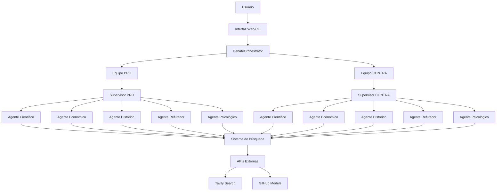

# 🎭 Sistema de Debates Autónomos con Inteligencia Artificial

[](https://www.python.org/downloads/)
[](https://opensource.org/licenses/MIT)
[](https://github.com/langchain-ai/langgraph)
[](https://streamlit.io/)

> Un sistema avanzado donde dos equipos de agentes de IA especializados investigan y debaten sobre cualquier tema usando evidencia real de internet.

## 🚀 Características Principales

- **🤖 Agentes Especializados**: Cada equipo cuenta con 5 agentes expertos (científico, económico, histórico, refutador, psicológico)
- **🧠 Supervisores Inteligentes**: Coordinan equipos y construyen argumentos estratégicos
- **🔍 Investigación Real**: Búsqueda automática de evidencia en internet usando APIs especializadas
- **📊 Evaluación Automática**: Sistema de puntuación y determinación automática del ganador
- **🌐 Interfaz Web**: Interfaz moderna con Streamlit para configurar y visualizar debates
- **⚡ Orquestación Avanzada**: Flujo de trabajo implementado con LangGraph
- **📝 Logging Completo**: Sistema de trazabilidad y auditoría detallado

## 🏗️ Arquitectura del Sistema



## 📦 Instalación

### Prerrequisitos

- Python 3.8 o superior
- Acceso a GitHub Models (token requerido)
- API key de Tavily para búsquedas (opcional pero recomendado)

### Instalación paso a paso

1. **Clonar el repositorio**
```bash
git clone https://github.com/tu-usuario/debates-ai-system.git
cd debates-ai-system
```

2. **Crear entorno virtual**
```bash
python -m venv debatesagent
source debatesagent/bin/activate  # Linux/Mac
# o
debatesagent\Scripts\activate  # Windows
```

3. **Instalar dependencias**
```bash
pip install -r requirements.txt
```

4. **Configurar variables de entorno**
```bash
cp .env.example .env
# Editar .env con tus credenciales
```

### Configuración de APIs

#### GitHub Models (Requerido)
1. Obtén un token en [GitHub Developer Settings](https://github.com/settings/tokens)
2. Agrega al `.env`:
```env
GITHUB_TOKEN=ghp_tu_token_aqui
GITHUB_MODELS_ENDPOINT=https://models.inference.ai.azure.com
```

#### Tavily Search (Opcional)
1. Registrate en [Tavily](https://tavily.com/)
2. Agrega al `.env`:
```env
TAVILY_API_KEY=tvly-dev-tu_api_key_aqui
```

## 🚦 Inicio Rápido

### Validar Sistema
```bash
python system_validator.py
```

### Interfaz Web (Recomendado)
```bash
streamlit run web_interface.py
```

### Interfaz de Línea de Comandos
```bash
python run_debate.py
```

### Ejemplo de Uso Programático
```python
from src.agents.debate_graph import DebateOrchestrator, DebateConfig

# Configurar debate
config = DebateConfig(
    topic="Inteligencia Artificial en el Trabajo",
    pro_position="La IA mejorará las condiciones laborales",
    contra_position="La IA eliminará empleos masivamente",
    max_rounds=3
)

# Ejecutar debate
orchestrator = DebateOrchestrator()
resultado = orchestrator.run_debate(config)

# Ver ganador
print(f"Ganador: {resultado['winner']}")
```

## 📁 Estructura del Proyecto

```
debates-ai-system/
├── src/
│   ├── agents/
│   │   ├── SlaveAgent.py          # Agentes investigadores especializados
│   │   ├── SupervisorAgent.py     # Supervisores de equipos
│   │   └── debate_graph.py        # Orquestador principal con LangGraph
│   ├── utils/
│   │   ├── github_models.py       # Integración con GitHub Models
│   │   └── search.py              # Sistema de búsqueda web
│   └── config.py                  # Configuración central del sistema
├── web_interface.py               # Interfaz web con Streamlit
├── run_debate.py                  # Interfaz de línea de comandos
├── system_validator.py            # Validador de configuración
├── logging_setup.py               # Sistema de logging avanzado
├── requirements.txt               # Dependencias del proyecto
├── .env                          # Variables de entorno
└── README.md                     # Este archivo
```

## 🎯 Cómo Funciona

### 1. Configuración Inicial
- El usuario define el tema y las posiciones de cada equipo
- Se crean dos supervisores (PRO y CONTRA)
- Cada supervisor gestiona 5 agentes especializados

### 2. Fase de Investigación
- Cada agente busca evidencia según su especialidad:
  - **Científico**: Estudios y evidencia científica
  - **Económico**: Análisis económicos y financieros
  - **Histórico**: Contexto histórico y antecedentes
  - **Refutador**: Críticas y limitaciones
  - **Psicológico**: Efectos psicológicos y sociales

### 3. Construcción de Argumentos
- Los supervisores seleccionan la mejor evidencia
- Construyen argumentos estratégicos usando LLMs
- Responden a los argumentos del equipo contrario

### 4. Evaluación y Decisión
- Sistema de puntuación basado en:
  - Calidad de la evidencia
  - Coherencia de argumentos
  - Nivel de confianza de los supervisores
- Determinación automática del ganador

## ⚙️ Configuración Avanzada

### Variables de Entorno Principales

| Variable | Descripción | Requerido |
|----------|-------------|-----------|
| `GITHUB_TOKEN` | Token de GitHub Models | ✅ Sí |
| `TAVILY_API_KEY` | API key para búsquedas | ⚠️ Recomendado |
| `MAX_ROUNDS` | Número máximo de rondas | ❌ No (default: 3) |
| `AGENTS_PER_TEAM` | Agentes por equipo | ❌ No (default: 5) |
| `DEBUG_MODE` | Modo de depuración | ❌ No (default: True) |

### Configuración de Límites

Para evitar rate limiting y optimizar costos:

```python
# En config.py
MAX_FRAGMENTS_PER_AGENT = 5     # Fragmentos por agente
MAX_QUERIES_PER_AGENT = 2       # Búsquedas por agente
MIN_DELAY_BETWEEN_API_CALLS = 1.5  # Segundos entre llamadas
```

## 🧪 Testing y Validación

### Ejecutar Validación Completa
```bash
python system_validator.py
```

### Test de Componentes Individuales
```python
# Test de agente individual
from src.agents.SlaveAgent import SlaveAgent
from src.config import AgentRole

agente = SlaveAgent(role=AgentRole.CIENTIFICO, team="pro")
fragmentos = agente.research("Beneficios de la inteligencia artificial")

# Test de supervisor
from src.agents.SupervisorAgent import SupervisorAgent

supervisor = SupervisorAgent(
    team="pro",
    position="La IA es beneficiosa"
)
evidencia = supervisor.orchestrate_research("Investiga beneficios de IA")
```

## 📊 Monitoreo y Logs

El sistema genera logs detallados organizados por componente:

```
logs/
├── debate_20241208_143022.log      # Log principal del debate
├── supervisor_20241208_143022.log   # Logs de supervisores
├── agent_20241208_143022.log        # Logs de agentes
├── search_20241208_143022.log       # Logs de búsquedas
└── error_20241208_143022.log        # Logs de errores
```

### Métricas Disponibles
- Número de búsquedas realizadas
- Fragmentos de evidencia encontrados
- Puntuaciones de confianza
- Tiempos de respuesta
- Errores y warnings

## 🎨 Personalización

### Agregar Nuevos Roles de Agentes

1. Editar `src/config.py`:
```python
class AgentRole(Enum):
    CIENTIFICO = "cientifico"
    ECONOMICO = "economico"
    # ... roles existentes
    LEGAL = "legal"  # Nuevo rol
```

2. Configurar especialización en `SlaveAgent.py`:
```python
AgentRole.LEGAL: {
    "search_types": ["legal", "general"],
    "keywords": ["ley", "legal", "jurídico", "normativa"],
    # ... configuración completa
}
```

### Estrategias de Argumentación Personalizadas

Editar `SupervisorAgent.py` para agregar nuevas estrategias:

```python
class ArgumentStrategy(Enum):
    # ... estrategias existentes
    EMOTIONAL_APPEAL = "emotional_appeal"  # Nueva estrategia
```

## 🤝 Contribuir

1. Fork el proyecto
2. Crea una rama para tu feature (`git checkout -b feature/AmazingFeature`)
3. Commit tus cambios (`git commit -m 'Add some AmazingFeature'`)
4. Push a la rama (`git push origin feature/AmazingFeature`)
5. Abre un Pull Request

### Guías de Desarrollo

- Seguir PEP 8 para estilo de código
- Agregar docstrings a todas las funciones públicas
- Incluir tests para nuevas funcionalidades
- Actualizar documentación relevante

## 🔧 Solución de Problemas

### Problemas Comunes

#### "No se puede conectar con GitHub Models"
```bash
# Verificar token
echo $GITHUB_TOKEN

# Regenerar token en GitHub si es necesario
```

#### "Rate limit exceeded"
```bash
# Aumentar delays en config.py
MIN_DELAY_BETWEEN_API_CALLS = 3.0  # Aumentar a 3 segundos
```

#### "No search results found"
```bash
# Verificar API key de Tavily
echo $TAVILY_API_KEY

# El sistema puede funcionar sin búsquedas pero con calidad reducida
```

### Logs de Depuración

Activar modo debug en `.env`:
```env
DEBUG_MODE=True
```

## 📚 Documentación Técnica

### APIs Utilizadas

- **GitHub Models**: Para modelos de lenguaje (GPT-4o-mini, etc.)
- **Tavily Search**: Para búsquedas web especializadas
- **LangGraph**: Para orquestación de flujos complejos

### Patrones de Diseño Implementados

- **Factory Pattern**: Creación de agentes y supervisores
- **Strategy Pattern**: Diferentes estrategias de argumentación
- **Observer Pattern**: Sistema de logging y monitoreo
- **State Machine**: Gestión de fases del debate con LangGraph

## 📈 Roadmap

- [ ] Soporte para más proveedores de LLM (OpenAI, Anthropic)
- [ ] Interfaz de administración web
- [ ] API REST para integración externa
- [ ] Soporte para debates multiidioma
- [ ] Análisis de sentimientos en argumentos
- [ ] Exportación a formatos académicos (LaTeX, APA)
- [ ] Métricas avanzadas de calidad argumentativa

## 📄 Licencia

Este proyecto está bajo la Licencia MIT - ver el archivo [LICENSE](LICENSE) para más detalles.

## 🙏 Reconocimientos

- [LangChain](https://github.com/langchain-ai/langchain) por el framework de LLM
- [LangGraph](https://github.com/langchain-ai/langgraph) por la orquestación
- [Streamlit](https://streamlit.io/) por la interfaz web
- [Tavily](https://tavily.com/) por las capacidades de búsqueda

## 👨‍💻 Autor

**Tu Nombre**
- GitHub: [@tu-usuario](https://github.com/tu-usuario)
- LinkedIn: [Tu Perfil](https://linkedin.com/in/tu-perfil)
- Email: tu-email@ejemplo.com

---

⭐ **Si este proyecto te resulta útil, ¡no olvides darle una estrella!** ⭐